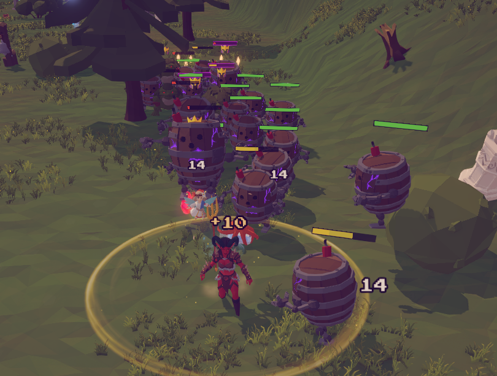

# Sineus Arena - Monster HP Bars Mod



A client-side BepInEx mod for **Sineus Arena** that adds dynamic, world-space overhead health bars to monsters.

---

## Features

- **World-Space Billboards**: UI health bars float cleanly above each monster and dynamically face the main camera.
- **Ghost Health Bar Animation**: A yellow "ghost" bar drains behind the real health bar after taking damage, giving it a classic arcade/RPG feel.
- **Color-Coded Health Thresholds**: Smoothly lerps between customizable colors as health drops (🟢 Green/Healthy → 🟡 Yellow/Damaged → 🔴 Red/Critical).
- **Elite & Boss Accents**: Features distinct colored borders (Purple for Elites, Orange for Bosses).
- **Seamless Pooling & Lair Spawning**: Handled directly via `UnitManager.RegisterUnit` and deferred frame retries, making it completely stable for lair spawns and object pooling in multiplayer.

---

## Configuration

After launching the game once with the mod installed, a configuration file will be generated at:
`BepInEx/config/com.sineusarena.monsterhpbars.cfg`

Here you can customize:
- Show only enemies (default: `true`)
- Show boss only (default: `false`)
- Always show HP bars vs. fade out after taking damage (default: `true`)
- Visibility duration after damage (default: `5.0` seconds)
- Bar width, height, and additional head padding
- All color thresholds and specific RGB values

---

## Installation

1. Ensure [BepInEx 5](https://github.com/BepInEx/BepInEx/releases) is installed for Sineus Arena.
2. Download `MonsterHPBars.dll`.
3. Drop the DLL file into your `BepInEx/plugins/` directory (e.g., `BepInEx/plugins/MonsterHPBars.dll`).
4. Launch the game!

---

## Development

Built targeting `.NET Standard 2.1` to match Unity 6's scripting runtime.

### Requirements:
- .NET SDK (v6.0 or newer)
- Sineus Arena game assemblies located in `SineusArena_Data/Managed/`

### Build:
```bash
dotnet build -c Release
```
The compiled library will be generated at `bin/Release/netstandard2.1/MonsterHPBars.dll`.
